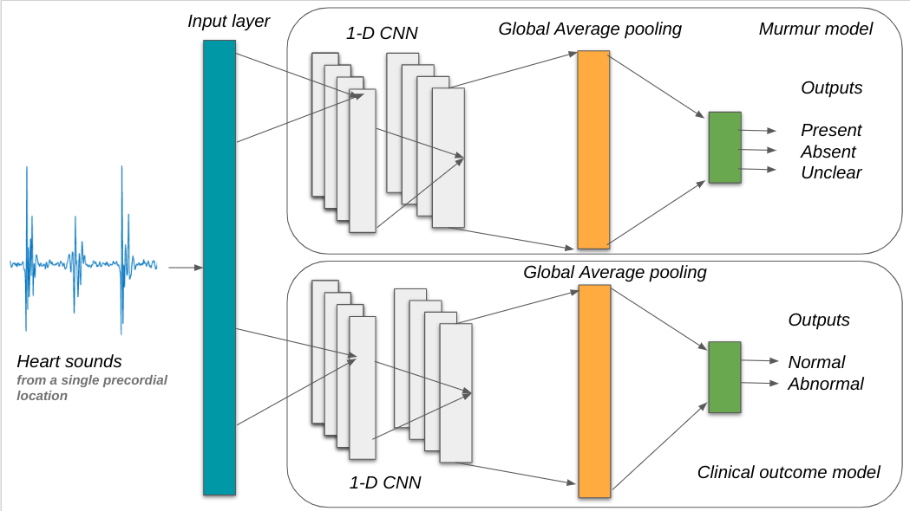

# Phonocardiogram Classification Using 1-Dimensional Inception Time Convolutional Neural Networks : George B. Moody PhysioNet Challenge 2022
## Team name: Simulab
---

[](https://paperswithcode.com/sota/predict-clinical-outcome-on-circor-digiscope?p=phonocardiogram-classification-using-1)
[](https://paperswithcode.com/sota/classify-murmurs-on-circor-digiscope?p=phonocardiogram-classification-using-1)


#### The 1-D CNN Inception time Architecture of the two classifiers

This repository is associated with the paper: [*Phonocardiogram Classification Using 1-Dimensional Inception Time Convolutional Neural Networks*](https://ieeexplore.ieee.org/document/10081878)

Full reference to the original paper :

> B. -J. Singstad, A. M. Gitau, M. K. Johnsen, J. Ravn, L. A. Bongo and H. Schirmer, "Phonocardiogram Classification Using 1-Dimensional Inception Time Convolutional Neural Networks," 2022 Computing in Cardiology (CinC), Tampere, Finland, 2022, pp. 1-4, doi: 10.22489/CinC.2022.108.

## Team members:
* Markus Johnsen
* Johan Ravn
* Lars Ailo Bongo
* Henrik Schirmer
* Antony M. Gitau
* Bjørn-Jostein Singstad
---------------------------------


## What's in this repository?
This repository contains the code for our contribution to the George B. Moody PhysioNet Challenge 2022. The objective of this challenge was to identify murmurs as present, absent or unclear and predict clinical outcome as normal or abnormal from phonocardiograms collected from multiple auscultation locations on the chest walls using digital stethoscope. 

We trained and tested two 1-dimensional convolutional
neural networks (CNN) on a PCG data set (5272 PCGs) from a pediatric
population of 1568 individuals. One model predicted murmurs, while the other model predicted clinical outcomes.
Both models were trained to give recording-wise predictions, while the final predictions were given for every patient (patient wise predictions).

Our team, **Simulab**, trained a clinical outcome classifier that achieved a challenge cost score of `8720 (ranked 1st out of 305 submissions)` and the murmur classifier achieved a weighted
accuracy of `0.585 (ranked 182nd out of 305 submissions)`
on the validation set.

## A brief of the files and folders in this repository


### Python scripts
This repository contains some scripts we can edit and some scripts provided by the organizers of George B. Moody PhysioNet Challenge 2022 which should **NOT** be edited

#### Can be edited:
* `cross_validate.py`
* `team_code.py`

#### Should not be edited
* `evaluate_model.py`
* `helper_code.py`
* `run_model.py`
* `train_model.py`

### Notebooks:
The repository also contains Jupyter Notebooks which makes easier to experiment with the data, models and other parameters. Some of the notebooks are designed to use in Google Colab in order to get access to GPUs and some notebooks are ok to run on your local computer.

#### Colab:
* `5-fold cross-validaton.ipynb` # contains code for cross-validating the model on the training set
* `Train and test model.ipynb` # contains code training model a model on the whole training set, save the weights, then upload the wights and test the model on the training set and finaly evaluate the predictions
* `pretrain model on 2015 dataset.ipynb` # contains code for pretraing model on phonocardiogram data from PhysioNet Challenge 2016. returns a .h5 file
#### Local:
* `EDA-Phonocardiogram-dataset.ipynb` # Exploratory data analysis of the dataset

### Other files:
This repository also contains the following files 
* `.gitignore`
* `LICENSE`
* `Dockerfile`
* `requirements.txt`


The Dockerfile and the requirements.txt are very important as they are used to build the docker image when submitting our code to the challenge organizers.

## Data:
The main data source is [the CirCor DigiScope Dataset](https://physionet.org/content/circor-heart-sound/1.0.0/) . When using the Jupyter Notebooks in Colab we need to download this dataset each time we start a new session.
 
 To speed up the downloading we have created [a Kaggle version](https://www.kaggle.com/datasets/bjoernjostein/the-circor-digiscope-phonocardiogram-dataset-v2) of this dataset. 
 
 To download the dataset, you will have to sign up for a Kaggle account, get a kaggle.json file from you Kaggle profile (containing a API token) and upload it to the root folder in the temporary folder in Colab.

To pretrain the models we use the open dataset from [PhysioNet Challenge 2016](https://physionet.org/content/challenge-2016/1.0.0/), also available on [Kaggle](https://www.kaggle.com/datasets/bjoernjostein/physionet-challenge-2016).

## Dependencies
* `numpy==1.21.6`
* `scipy==1.4.1`
* `scikit-learn==0.23.2`
* `joblib==0.17.0`
* `tensorflow == 2.8.2`
* `Cython==0.29.24`
* `pandas==1.3.2`
* `h5py==2.10.0`
* `tqdm==4.54.0`

## Run the code locally: 

You can try it by running the following commands on the Challenge training sets. These commands should take a few minutes or less to run from start to finish on a recent personal computer.

For this example, we implemented a random forest classifier with several features. You can use a different classifier, features, and libraries for your entry. This simple example is designed **not** to perform well, so you should **not** use it as a baseline for your model's performance.

This code uses four main scripts, described below, to train and run a model for the 2022 Challenge.

## Run the code using Docker

You can install the dependencies for these scripts by creating a Docker image (see below) and running

    pip install requirements.txt

You can train and run your model by running

    python train_model.py training_data model
    python run_model.py model test_data test_outputs

where `training_data` is a folder with the training data files, `model` is a folder for saving your model, `test_data` is a folder with the test data files (you can use the training data for debugging and cross-validation), and `test_outputs` is a folder for saving your model outputs. The [2022 Challenge website](https://physionetchallenges.org/2022/) provides a training database with a description of the contents and structure of the data files.

You can evaluate your model by running

    python evaluate_model.py labels outputs scores.csv class_scores.csv

where `labels` is a folder with labels for the data, such as the training database on the PhysioNet webpage; `outputs` is a folder containing files with your model's outputs for the data; `scores.csv` (optional) is a collection of scores for your model; and `class_scores.csv` (optional) is a collection of per-class scores for your model.


### How do I run these scripts in Docker?

Docker and similar platforms allow you to containerize and package your code with specific dependencies so that you can run your code reliably in other computing environments and operating systems.

To guarantee that we can run your code, please [install](https://docs.docker.com/get-docker/) Docker, build a Docker image from your code, and run it on the training data. To quickly check your code for bugs, you may want to run it on a small subset of the training data.

If you have trouble running your code, then please try the follow steps to run the example code.

1. Create a folder `example` in your home directory with several subfolders.

        user@computer:~$ cd ~/
        user@computer:~$ mkdir example
        user@computer:~$ cd example
        user@computer:~/example$ mkdir training_data test_data model test_outputs

2. Download the training data from the [Challenge website](https://physionetchallenges.org/2022). Put some of the training data in `training_data` and `test_data`. You can use some of the training data to check your code (and should perform cross-validation on the training data to evaluate your algorithm).

3. Download or clone this repository in your terminal.

        user@computer:~/example$ git clone https://github.com/physionetchallenges/python-classifier-2022.git

4. Build a Docker image and run the example code in your terminal.

        user@computer:~/example$ ls
        model  python-classifier-2022  test_data  test_outputs  training_data

        user@computer:~/example$ cd python-classifier-2022/

        user@computer:~/example/python-classifier-2022$ docker build -t image .

        Sending build context to Docker daemon  [...]kB
        [...]
        Successfully tagged image:latest

        user@computer:~/example/python-classifier-2022$ docker run -it -v ~/example/model:/physionet/model -v ~/example/test_data:/physionet/test_data -v ~/example/test_outputs:/physionet/test_outputs -v ~/example/training_data:/physionet/training_data image bash

        root@[...]:/physionet# ls
            Dockerfile             README.md         test_outputs
            evaluate_model.py      requirements.txt  training_data
            helper_code.py         team_code.py      train_model.py
            LICENSE                run_model.py

        root@[...]:/physionet# python train_model.py training_data model

        root@[...]:/physionet# python run_model.py model test_data test_outputs

        root@[...]:/physionet# python evaluate_model.py model test_data test_outputs
        [...]

        root@[...]:/physionet# exit
        Exit


# Results


|Model| Best parameters | Metrics | Training | Validation | Test |
|:-----:|:-----------------:|:---------:|:----------:|:------------:|:----:|
|Murmur|Adam optimization|Weighted accuracy |0.497 ± 0.083| 0.585|0.593
||Weighted categorical cross entropy|Challenge metrics|13158 ± 1283|8866|13134
||20 batch size|Accuracy|0.446 ± 0.070|0.423|0.497
||30 epoch|F measure|0.403 ± 0.055|0.384|0.398
|Clinical | Adam optimization| Weighted accuracy|0.713 ± 0.042|0.732|0.703
||20 batch size|Challenge metrics|12315 ± 903|8720|12419
||20 epoch| Accuracy |0.51 ± 0.047|0.537|0.537
||Weighted categorical cross entropy| F measure|0.465 ± 0.061 |0.530|0.503

# Citation
```
@inproceedings{singstad_2022_phono,
  title={Phonocardiogram classification using 1-dimensional inception time convolutional neural networks},
  author={Singstad, Bj{\o}rn-Jostein and Gitau, Antony M and Johnsen, Markus Kreutzer and Ravn, Johan and Bongo, Lars Ailo and Schirmer, Henrik},
  booktitle={2022 Computing in Cardiology (CinC)},
  volume={498},
  pages={1--4},
  year={2022},
  organization={IEEE}
}
```

